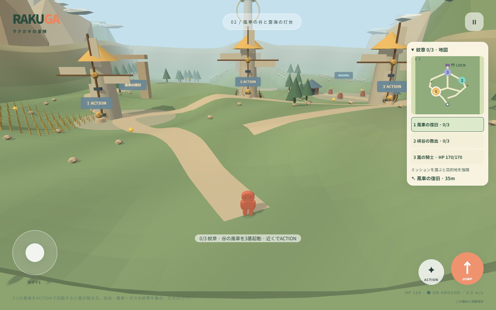
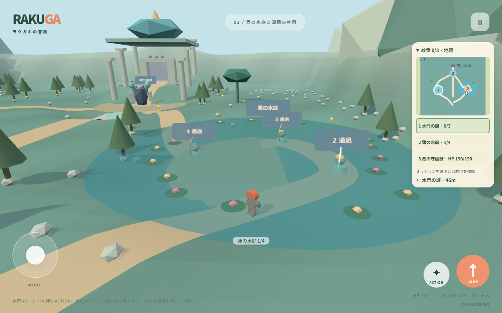
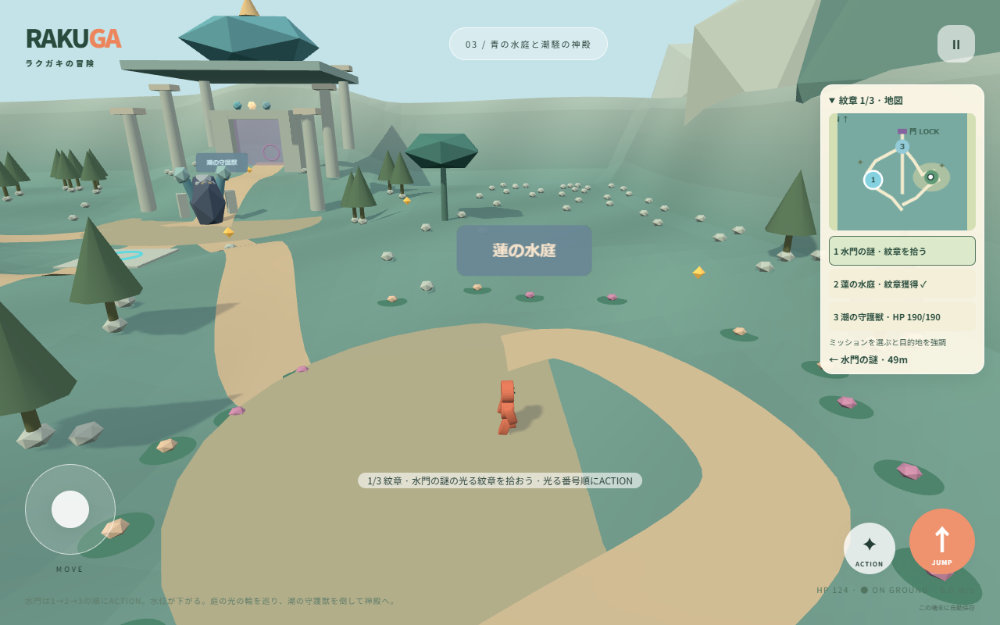
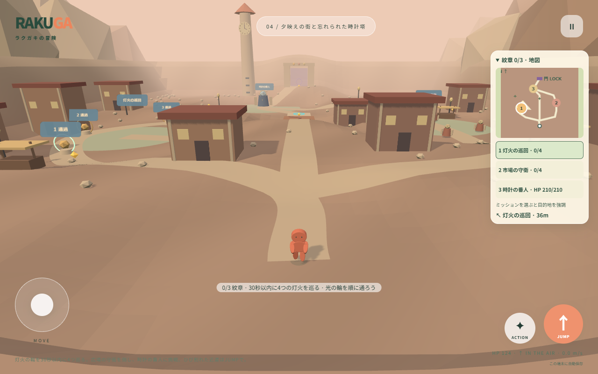
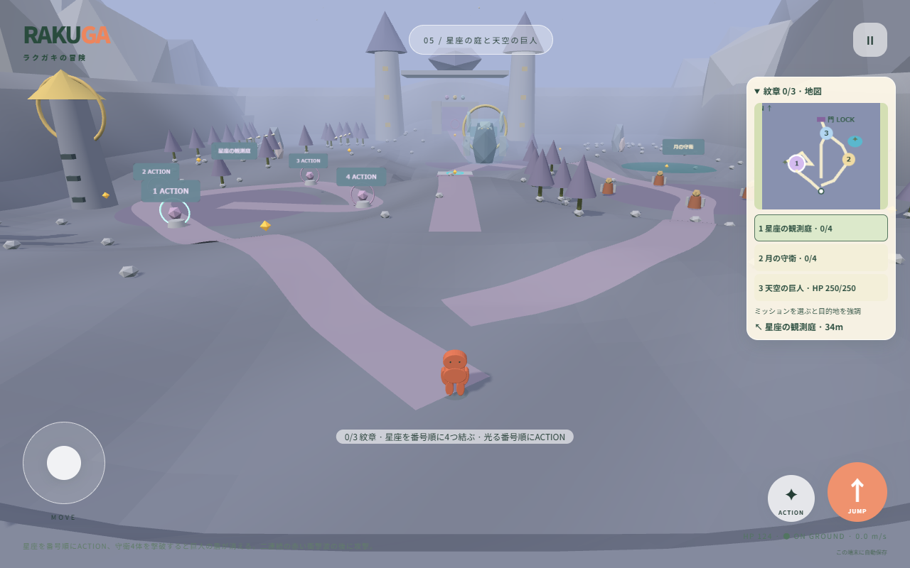

# 5.0 ステージ2〜5のミッションフィールド

2026-10-04。旧浮島コースを、起伏・坂・曲線の道でつながる約96×112mのフィールドへ置き換えた。1ステージ制作するたびに独立批評と修正・再評価を行い、合格を得てから次を制作した。[批評記録](STAGE_CRITIQUE.md)。

## 共通ルール

3つのミッションを達成して、現地に出現する紋章を拾う。すべて回収すると門の封印と衝突が解除され、北のゴールへ進める。仕掛け・討伐の達成だけでは紋章を取得した扱いにならない。

地図で案内するミッションを選べる。矢印と距離は次の仕掛け・敵・報酬を指す。縦画面では地図を折りたたんでも方向と目的を表示する。ミッションの順番は自由だが、番号付きの仕掛けはその番号順に操作し、最終ステージの巨人は先に2つの課題を達成する必要がある。

紋章はHPを回復し、その地域から復帰できるようになる。リトライは討伐と仕掛けの達成を保持し、未討伐のボスを回復する。休憩所も復帰地点になる。時間制限が切れた灯火巡回は最初の輪から再開できる。ブラウザを閉じた後の走行途中の復元は行わない。

各フィールドに9個の回復用かけらと2か所の発見地点を配置。橋・屋根・主要建造物に衝突を設け、地形の描画と物理には同じ三角形を使用する。崩れる橋は任意の近道で、下の地面から戻れる。

## ステージ2：風車の谷と雲海の灯台

麦畑と3基の風車、谷を横切る木橋、救出基地、石のアーチ、雲海を望む灯台を配置した。

| ミッション | 操作と変化 |
| --- | --- |
| 風車の復旧 | 3基に近づいてACTION。復旧すると峡谷の風が弱まり、羽根が回る。 |
| 峡谷の救出 | 東の基地の敵3体を倒す。 |
| 嵐の騎士 | 予兆と衝撃波を避け、緑の隙に近づいて攻撃。 |

風車を先に回すと中央の移動が楽になる。先に東の救出やボスへ向かうこともできる。西のアーチと東の展望台には寄り道のかけらがある。

## ステージ3：青の水庭と潮騒の神殿

西に大水道と3つの水門、東に水没した蓮庭、北に柱と宝石屋根の神殿を配置した。

| ミッション | 操作と変化 |
| --- | --- |
| 水門の謎 | 1→2→3の順にACTION。水位が下がり、蓮庭を通常速度で移動できる。 |
| 蓮の水庭 | 光の輪4つを番号順に通過。排水前にも攻略可能だが、水中では移動が遅くなる。 |
| 潮の守護獣 | 神殿前の三頭の守護獣を倒す。 |

排水後は水面を庭底より下まで下げ、蓮も下がる。見た目と水の判定を一致させた。大水道と蓮の中庭には発見地点がある。

## ステージ4：夕映えの街と忘れられた時計塔

夕暮れの家並み、西の灯火街、東の市場と屋台、止まった時計塔を配置した。

| ミッション | 操作と変化 |
| --- | --- |
| 灯火の巡回 | 最初の輪から30秒以内に4つの輪を番号順に通過。残り時間と次の番号を常時表示。 |
| 市場の守衛 | 広場の守衛4体を倒す。 |
| 時計の番人 | 番人を倒すと時計針が動き出す。 |

中央のひび割れた橋は崩れる近道。西の小路や市場を回って進むこともできる。時間制限は灯火ミッションだけで、失敗しても再挑戦できる。

## ステージ5：星座の庭と天空の巨人

結晶と星の庭、西の小観測塔、東の月映しの泉、双塔と宝石屋根の天空城を配置した。

| ミッション | 操作と変化 |
| --- | --- |
| 星座の観測庭 | 4つの星を番号順にACTION。光の線で星座がつながり、西の風が弱まる。 |
| 月の守衛 | 広場の守衛4体を倒す。 |
| 天空の巨人 | 上の2課題の達成で盾が消える。二連続の衝撃波を避け、その後の緑の隙に攻撃。 |

巨人は盾がある間に攻撃しても傷つかない。1回目の衝撃波直後も防御が続き、2回目の後に攻撃できる。警告色・範囲と案内で次の動きを知らせる。

## 保存と検証範囲

アプリ・ランキングの版を5.0.0へ更新。旧タイムは比較対象から外して退避する。キャラクター・経験値・解放状況とステージ1の星を保持し、内容を変更したステージ2〜5の旧星評価だけを初回更新時にリセットする。保存形式4は維持する。

各ステージの独立批評合格は、この変更範囲の評価である。PCの実キー入力・画面サイズ検証と、スマートフォン実機の操作感・性能を区別する。結果は[QA.md](QA.md)に記載。
